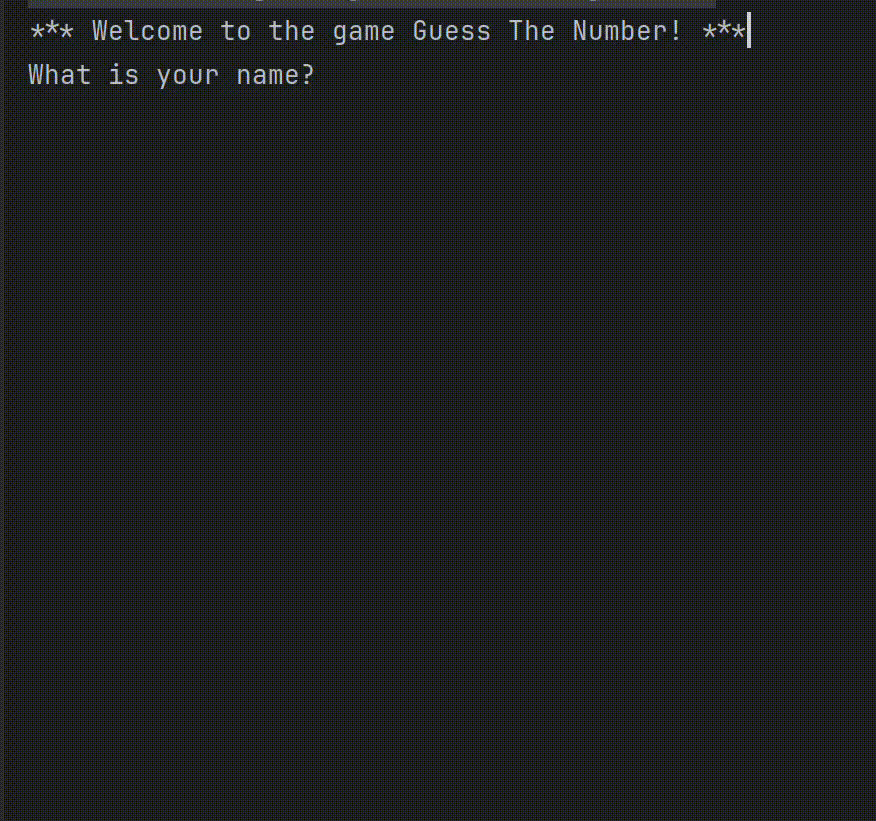

# Guess the Number

## Índice

* [1. Resumen del proyecto](#1-resumen-del-proyecto)
* [2. Ejecutar el Código](#2-ejecutar-el-código)
* [3. Historias de Usuario](#3-historias-de-usuario)
* [4. Testing](#4-testing)
* [5. Lenguajes y Frameworks](#5-lenguajes-y-frameworks)

## 1. Resumen del Proyecto

**Guess The Number** ❓ es un juego interactivo desarrollado para ejecutarse en la terminal. Durante el juego:

- El usuario y el ordenador se turnan para intentar adivinar el número.
- Después de cada intento, se muestra:
    - El nombre del jugador (persona o computadora).
    - La suposición realizada.
    - Un mensaje indicando si la suposición fue "muy alta", "muy baja" o "correcta".
- El juego termina cuando uno de los jugadores adivina el número secreto.
- Al _final_, se muestra un mensaje de conclusión y una lista de todas las tentativas realizadas por el jugador ganador.
- El juego tiene la opción de _continuar_ con una nueva ronda o _terminar_ la sesión.



## 2. Ejecutar el Código

Clona el repositorio, luego navega al directorio del proyecto y compila el código utilizando un compilador de Java.
Luego, ejecuta el archivo principal 👩‍💻.

```bash
git clone https://github.com/abengl/guess-the-number.git
cd GuessTheNumber
javac GuessTheNumberGame.java
java GuessTheNumberGame
```

Para ejecutar los **tests**, asegúrate de tener _JUnit_ y _Mockito_ configurados en tu entorno. Luego, utiliza el
siguiente comando para ejecutar los tests:

```bash
cd GuessTheNumber
javac -cp .:junit-4.13.2.jar:mockito-core-3.3.3.jar GuessTheNumberGameTest.java
java -cp .:junit-4.13.2.jar:mockito-core-3.3.3.jar org.junit.runner.JUnitCore GuessTheNumberGameTest
```

## 3. Historias de Usuario

Este proyecto fue desarrollado teniendo en cuenta las siguientes historias de usuario:

- Como jugador, quiero intentar adivinar un número aleatorio, recibiendo pistas después de cada intento.
- Como jugador, quiero ver un resumen de mis intentos y saber si he ganado o perdido.
- Como jugador, quiero que el juego pueda reiniciarse fácilmente sin necesidad de salir y volver a entrar al programa.

## 4. Testing

El proyecto incluye tests que cubren las principales funcionalidades del juego :octocat:. Las pruebas están diseñadas para
verificar:

- Adivinanzas correctas, muy altas y muy bajas.
- La correcta interacción entre el jugador humano y el ordenador.
- La correcta ejecución de funciones clave como la creación de un nuevo número aleatorio y la reinicialización del
  juego.

## 5. Lenguajes y Frameworks

- **Java**: Lenguaje de programación principal ☕.
- **JUnit**: Framework para pruebas unitarias.
- **Mockito**: Framework para la creación de mocks en los tests.
